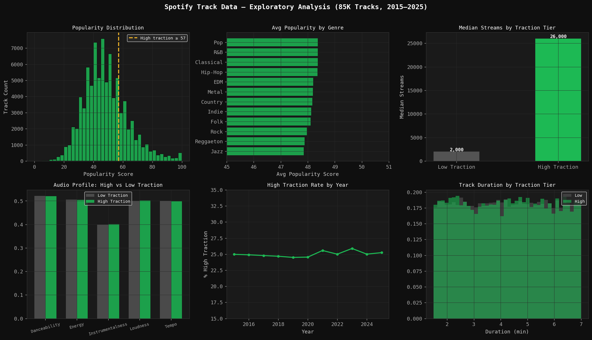

# Spotify Track Traction Predictor

This project started as a follow-up question to my Spotify A/B test analysis. That project found that Power Users churn hard when skip limits are applied — they don't upgrade, they leave. Which raised an obvious question: what if instead of frustrating users into upgrading, you just surfaced better tracks to them in the first place?

This model tries to answer the upstream version of that problem: **can we predict which tracks are going to gain traction, before they chart?**

---

## What it does

Takes 85,000 Spotify tracks (2015–2025) with audio features — danceability, energy, tempo, loudness, instrumentalness — plus metadata like genre, market, and release timing, and predicts whether a track will land in the top 25% of popularity scores.

The output isn't just a model accuracy number. The final cell scores every track into one of three tiers with a recommended action for each:

- 🟢 **High — Amplify** → push to editorial playlists, prioritize in Radio seeds
- 🟡 **Growing — Nurture** → add to algorithmic queues, test in Discover Weekly
- 🔴 **Low — Monitor** → deprioritize before spending promotion budget

---

## The modeling approach

I tested three models deliberately, not just to find the best one but to show the trade-offs:

**Logistic Regression** was the baseline. Fast, interpretable, coefficients you can read directly. AUC around 0.856. Good starting point but assumes a linear boundary between high and low traction, which isn't realistic.

**Random Forest** handles non-linearity and is robust to outliers. AUC 0.866. The trade-off is it's slower and harder to explain to a non-technical stakeholder.

**Gradient Boosting** was the winner at AUC 0.867 — it corrects errors sequentially, which works well here because the features interact (a track that's both high energy AND highly danceable behaves differently than one that's just one of those things). That's why I engineered `energy × danceability` as an explicit feature.

---

## The feature importance section is the most interesting part

I ran two importance methods on purpose because they tell different stories.

Built-in importance (impurity-based) is fast but can overstate features that have many possible split points. Permutation importance is more honest — it shuffles each feature and measures how much the model's AUC actually drops. If a feature doesn't hurt performance when scrambled, it wasn't really doing anything.

Stream count and release timing came out as the strongest signals. Among pure audio features, tempo and the energy-dance interaction mattered most. Genre differences were surprisingly small — Spotify's algorithm appears to surface strong tracks fairly evenly across genres.

---

## How to run it

```bash
pip install pandas numpy matplotlib scikit-learn
jupyter notebook Spotify_Track_Traction_Predictor.ipynb
```

Run all 8 cells in order. Cells 3, 5, and 6 save the dashboard figures to your working directory.

---

## Visualizations

### Exploratory Data Analysis


### Model Performance Comparison


### Feature Importance


---

## How this connects to the rest of my portfolio

This project and the [Spotify A/B Test Analysis](https://github.com/dhrumi01/spotify-ab-test-analysis) are meant to be read together. The A/B test identified *when* users churn. This model identifies *what* to show them before they get there. One project asks what happens when you restrict the experience — the other asks how to improve it instead.

---

*Dhrumi Kansara · MS Business Analytics · Arizona State University*  
[LinkedIn](#) · [GitHub](#)
